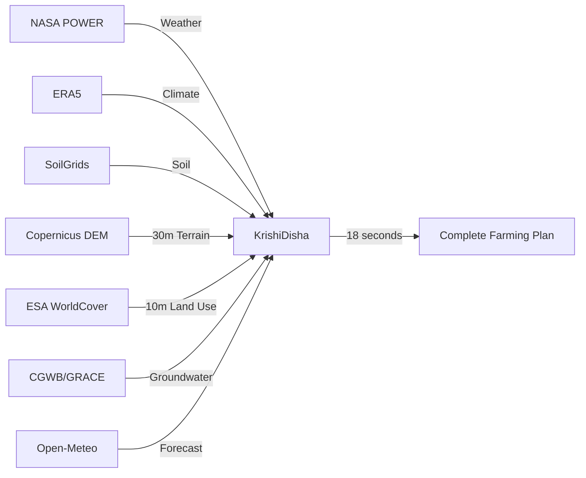

<div align="center">

# KrishiDisha
### New Direction to Smart Agriculture

**Team DISHA (दिशा)** | Pune Agriculture Hackathon 2026

*3 crop models. 7 data sources. 1 farming plan.*

[Live Demo](https://dev-krishi.shardul.date) · [Technical Docs](docs/TECHNICAL.md) · [Project Context](docs/PROJECT_CONTEXT.md)

</div>

---

## The Problem

> **70% of Indian farmers** make crop decisions without weather or soil data.

```
            India's Agriculture Crisis
  ┌─────────────────────────────────────────┐
  │                                         │
  │   $923M      0.3m/yr       70%         │
  │   wheat      groundwater   farmers     │
  │   losses     depletion     without     │
  │   from       across        weather     │
  │   ozone      India         guidance    │
  │                                         │
  │          ZERO tools combine:            │
  │   yield + water + nutrients + climate   │
  └─────────────────────────────────────────┘
```

No existing platform combines crop simulation, water management, nutrient planning, and climate risk analysis. Farmers are left guessing.

---

## The Solution

KrishiDisha is a **farm digital twin** that runs 3 world-class crop simulation models on real-time satellite and weather data — and delivers a complete farming plan in **18 seconds**.

```
  ┌──────────────────────────────────────────────────────────┐
  │                    KrishiDisha Engine                      │
  │                                                           │
  │   ┌─────────┐   ┌──────────┐   ┌─────────┐              │
  │   │ WOFOST  │   │ AquaCrop │   │  DSSAT  │   3 Models   │
  │   │  Yield  │   │  Water   │   │Nutrients│   in Parallel │
  │   └────┬────┘   └────┬─────┘   └────┬────┘              │
  │        │             │              │                     │
  │        └─────────┬───┘──────────────┘                     │
  │                  │                                        │
  │        ┌─────────▼──────────┐                             │
  │        │   ML Ensemble      │   28 features               │
  │        │   (GradientBoost)  │   from all models           │
  │        └─────────┬──────────┘                             │
  │                  │                                        │
  │        ┌─────────▼──────────┐                             │
  │        │  Unified Advisory  │   Score: 85/100             │
  │        └────────────────────┘                             │
  └──────────────────────────────────────────────────────────┘

              Powered by 7 Real-Time Data Sources
  ┌──────┬──────┬────────┬────────┬──────┬──────┬──────────┐
  │NASA  │ERA5  │Soil    │Terrain │Land  │Ground│ Weather  │
  │POWER │Coper.│Grids   │30m DEM │Cover │Water │ Forecast │
  └──────┴──────┴────────┴────────┴──────┴──────┴──────────┘
```

---

## How It Works

```
  Step 1                Step 2                Step 3
  ┌────────┐           ┌────────────┐        ┌──────────────┐
  │ Enter  │           │ Auto-      │        │ AI Recommends│
  │ Farm   │──────────▶│ Analyze    │───────▶│ Best Crops   │
  │ Location│          │ Everything │        │ for Your Land│
  └────────┘           └────────────┘        └──────┬───────┘
                                                     │
                                                     ▼
  Step 5                Step 4
  ┌──────────────┐     ┌──────────────┐
  │ Complete     │     │ Run 3 Models │
  │ Farming Plan │◀────│ in Parallel  │
  │ Delivered    │     │ (18 seconds) │
  └──────────────┘     └──────────────┘
```

**What you get:**

| Deliverable | Powered By | Example |
|:---|:---|:---|
| Optimal sowing period | Sowing Optimizer | *"Sow rice between Jun 8-14"* |
| Weekly irrigation schedule | AquaCrop (FAO) | *"Week 5: Apply 80mm — flowering stage, CRITICAL"* |
| Fertilizer plan with products | DSSAT | *"Basal: 50kg N + 75kg P (DAP 18:46:0)"* |
| Pest & disease risk | DSSAT stress + weather | *"Stem Borer risk HIGH in Aug-Sep"* |
| Activity timeline | All models combined | *Land prep → Sow → Irrigate → Harvest* |
| Hazard calendar | Weather analysis | *"Week 8: Flood risk — 180mm rain expected"* |
| 3D terrain with crop zones | Copernicus 30m DEM | *Valley: Rice, Slope: Wheat, Hilltop: Millet* |

---

## What Makes Us Different

```
                    KrishiDisha vs Competitors

  Feature              Krishi   CropIn  Fasal   Bharat
                       Disha                     Agri
  ─────────────────────────────────────────────────────
  Yield Simulation      ✅       ❌      ❌       ❌
  Water Optimization    ✅       ❌      ⚠️*      ❌
  Nutrient Planning     ✅       ❌      ❌       ❌
  Ozone Tracking        ✅       ❌      ❌       ❌
  3D Terrain            ✅       ❌      ❌       ❌
  No Hardware Needed    ✅       ✅      ❌       ✅
  ─────────────────────────────────────────────────────
  * Fasal requires physical IoT sensors ($$$)
```

### Our Killer Feature: OzoneSight

> **$923 million** in annual wheat losses from ground-level ozone in India.
> **Zero** tools help farmers with this invisible threat.
> KrishiDisha is the **first platform** to track ozone crop damage.

---

## Technology

### Three World-Class Crop Models

```
  ┌─────────────────────────────────────────────────────────┐
  │                                                         │
  │  WOFOST 7.2          AquaCrop (FAO)      DSSAT v4.8    │
  │  ───────────          ──────────────      ──────────    │
  │  Wageningen Univ.     UN Food & Agri.     IFDC/UF      │
  │                                                         │
  │  What: Daily crop     What: Water         What: Soil    │
  │  growth physics       productivity        nutrient      │
  │                       & irrigation        dynamics      │
  │                                                         │
  │  Gives: Yield         Gives: Irrigation   Gives: N/P/K  │
  │  (kg/ha), LAI,        schedule, drought   fertilizer    │
  │  biomass, growth      risk, water need    schedule,     │
  │  stage                                    pest stress   │
  │                                                         │
  │  Crops: 13            Crops: 8            Crops: 9      │
  │                                                         │
  └─────────────────────────────────────────────────────────┘
```

### Seven Data Sources



### ML Ensemble: 28 Features from 5 Data Domains

```
  Weather (10)     Soil (6)      Stress (3)    Crop (3)    Models (3)
  ──────────────   ──────────    ──────────    ─────────   ──────────
  GDD total        Clay %        Ozone loss    Crop type   WOFOST yield
  Rainfall         Sand %        GW extraction Water need  AquaCrop WP
  Drought days     Org. carbon   GW depth      Base yield  DSSAT stress
  Solar radiation  pH                                      
  Heat stress      Bulk density                Location (3)
  Cold stress      Water holding               ──────────
  Humidity                                     Lat, Lon
  Wind speed                                   Elevation
  Temp range
  Rain variability
```

---

## Market Opportunity

```
  India Agritech Market
  ━━━━━━━━━━━━━━━━━━━━━━━━━━━━━━━━━━━━

  2024    ████████░░░░░░░░░░░░░░░░  $9B

  2030    ████████████████████████  $28B
                                   (25% CAGR)

  Target Markets:
  ┌──────────────────────────────────┐
  │ PMFBY Crop Insurance   $4.5B    │
  │ 10,000+ FPOs           30L      │
  │ State Ag. Departments   28      │
  │ Individual Farmers      150M+   │
  └──────────────────────────────────┘
```

---

## Quick Start

```bash
# Clone
git clone https://github.com/dateshardul/pune-agri-hackathon
cd pune-agri-hackathon

# Backend
cd backend && python -m venv venv && source venv/bin/activate
pip install -r requirements.txt
uvicorn app.main:app --reload --port 8001

# Frontend (new terminal)
cd frontend && npm install && npm run dev
```

Open `http://localhost:5173` → Enter any Indian lat/lon → Analyze → Get your farming plan.

---

## Project Structure

```
pune-agri-hackathon/
├── backend/
│   └── app/
│       ├── api/routes/        # 16 API endpoints
│       ├── models/            # Request/response schemas
│       └── services/          # 15 service modules
│           ├── unified_analysis.py   # Main orchestrator
│           ├── wofost.py             # WOFOST simulation
│           ├── aquacrop_sim.py       # AquaCrop simulation
│           ├── dssat_sim.py          # DSSAT simulation
│           ├── ml_predictor.py       # ML ensemble (28 features)
│           ├── sowing_optimizer.py   # Season→Month→Week optimizer
│           └── ...                   # 9 more data services
├── frontend/
│   └── src/
│       ├── components/
│       │   ├── FarmAnalysis.tsx       # Main 5-step wizard
│       │   ├── MapView.tsx           # 3D terrain engine
│       │   └── ...                   # 8 more components
│       └── services/api.ts           # API client + types
├── docs/
│   ├── PROJECT_CONTEXT.md            # Full project context for AI
│   └── TECHNICAL.md                  # Technical README
└── CLAUDE.md                         # AI assistant instructions
```

---

## API Overview

```
POST /api/farm/analyze          ← The main endpoint (runs everything)
POST /api/simulate/             ← WOFOST crop simulation
POST /api/simulate/water-advisory  ← AquaCrop irrigation
POST /api/simulate/nutrient-advisory ← DSSAT fertilizer
POST /api/simulate/sowing-optimizer  ← Best sowing period
POST /api/predict/              ← ML yield prediction
GET  /api/data/weather          ← NASA POWER
GET  /api/data/soil             ← SoilGrids
GET  /api/elevation/dem         ← 30m terrain
GET  /api/groundwater/          ← Aquifer status
GET  /api/ozone/                ← Ozone damage
POST /api/advisory/chat         ← AI farm advisor
```

---

<div align="center">

### Team DISHA (दिशा)

*New Direction to Smart Agriculture*

**Pune Agriculture Hackathon 2026** | Theme 7: Climate Resilient Digital Agriculture

---

Built with real science for real farmers.

</div>
