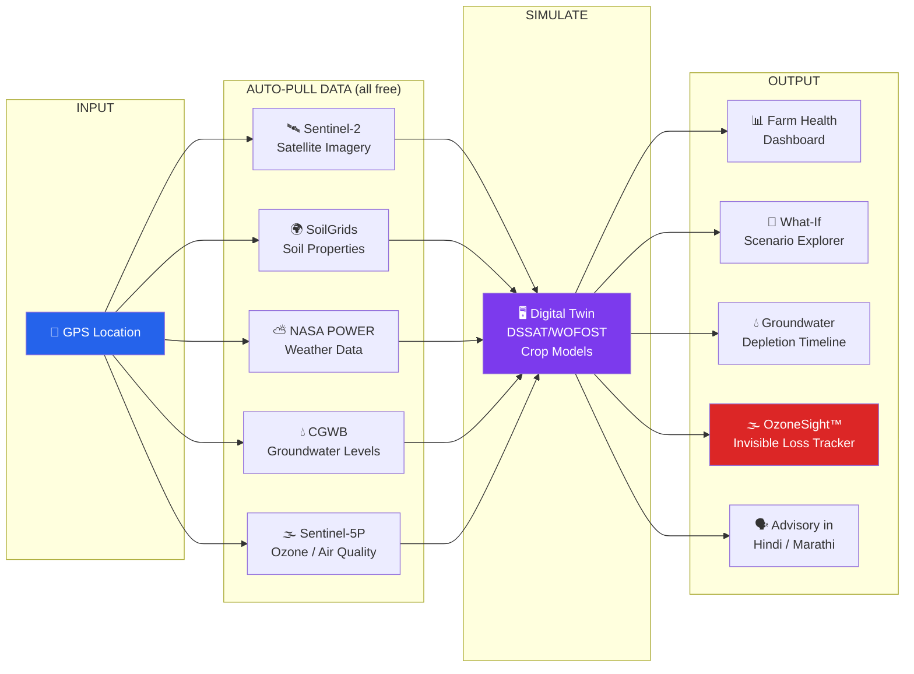
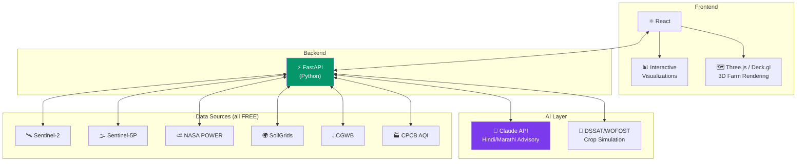
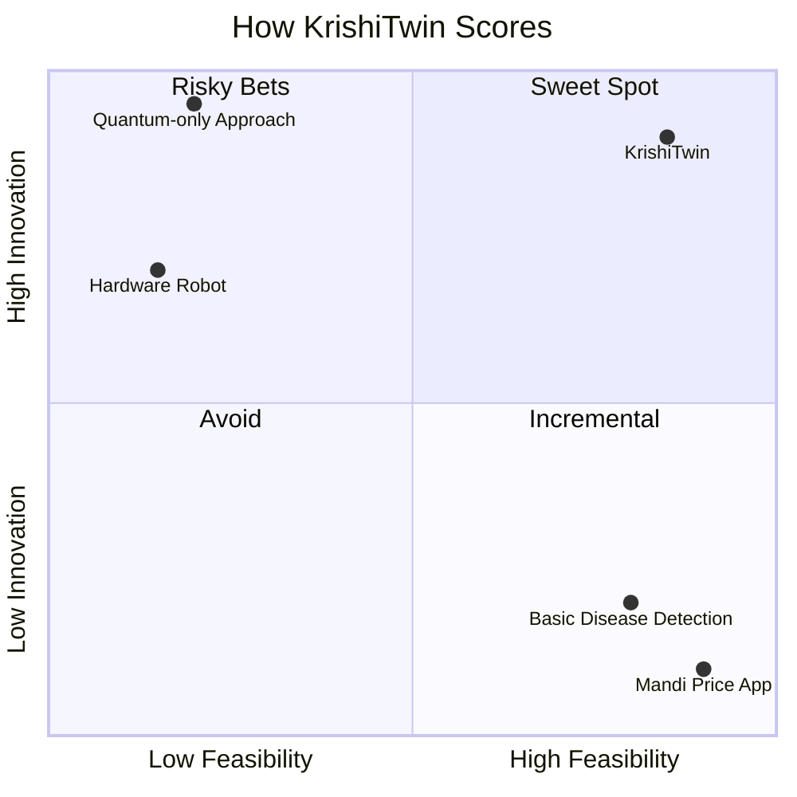
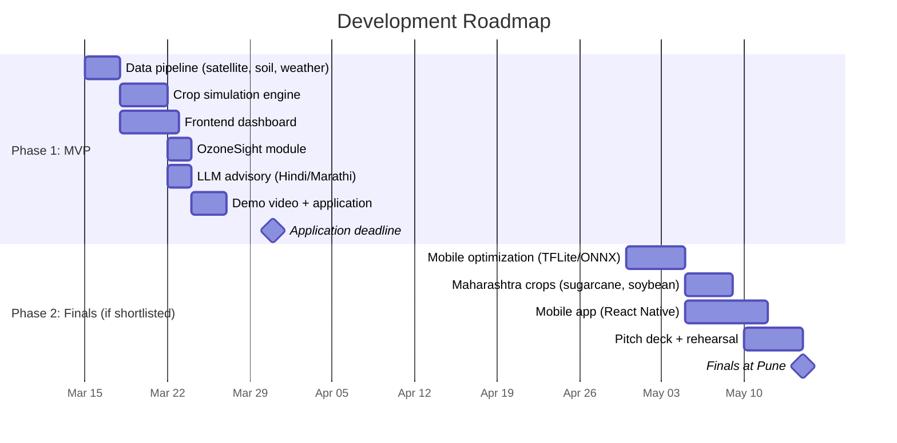

# KrishiTwin — Digital Twin Farm Resilience Simulator

> **Pune Agriculture Hackathon 2026** | Theme 7: Climate Resilient Digital Agriculture

## The Problem

```mermaid
graph TD
    subgraph "India's Agricultural Convergence Crisis (2026-2029)"
        A["💧 Groundwater Collapse<br/>17% aquifers over-exploited<br/>60% critical by 2032"]
        B["🌡️ Heat Stress<br/>10-15% wheat yield loss<br/>in 3 of last 5 years"]
        C["🌱 Soil Carbon Collapse<br/>50%+ soils below 0.5% SOC<br/>30% below survival threshold"]
        D["🌫️ Invisible Ozone Damage<br/>₹25,000-40,000 Cr/yr losses<br/>Zero farmer awareness"]
        E["🐛 Fall Armyworm<br/>Endemic on maize<br/>Host-switching to rice"]
        F["🐝 Pollinator Decline<br/>20-30% bee population drop<br/>Mustard, apple, coffee hit"]
    end

    A -->|"No water buffer<br/>during heat waves"| B
    B -->|"Stressed plants<br/>more vulnerable"| E
    C -->|"Soil can't hold<br/>remaining water"| A
    D -->|"Invisible 5-15%<br/>yield reduction"| C
    F -->|"25-40% less<br/>mustard yield"| D

    style A fill:#dc2626,color:#fff
    style B fill:#ea580c,color:#fff
    style C fill:#ca8a04,color:#fff
    style D fill:#7c3aed,color:#fff
    style E fill:#059669,color:#fff
    style F fill:#2563eb,color:#fff
```



**No existing tool models this convergence.** KrishiTwin is the first.

## How It Works



### What-If Scenarios

```
┌─────────────────────────────────────────────────────────────┐
│  "What if February hits 38°C?"        →  Wheat yield: -12%  │
│  "What if El Niño cuts monsoon 15%?"  →  Rice yield: -18%   │
│  "Switch sugarcane → pomegranate?"    →  Water saved: 2100mm │
│  "Your well runs dry in..."          →  ⚠️  4.2 years       │
│  "Ozone is silently costing you..."  →  ₹8,400/acre/year    │
└─────────────────────────────────────────────────────────────┘
```

## Tech Stack



## Judging Criteria



| Criteria | Score | Why |
|:---------|:-----:|:----|
| Innovativeness | **10/10** | First Indian farm digital twin + ozone tracking |
| Feasibility | **9/10** | All free/open data, proven crop models |
| Technology | **10/10** | Digital twin + satellite + crop sim + LLM |
| Scalability | **9/10** | Any GPS in India, SaaS-ready |

## Timeline



## Team

| Role | Person | Skills |
|:-----|:-------|:-------|
| Project Lead / System Architecture | **Shardul** (IIT, Mech) | Simulation, modeling, product design |
| ML + Backend | *Seeking CS/AI student* | Python, ML, APIs |
| Frontend | *Seeking CS student* | React, visualization |
| Domain Expert | *Seeking Ag/Bio student* | Crop science, validation |

## Project Status: `THEME SELECTED → BUILDING MVP`

```
[████████░░░░░░░░░░░░] 15% — Architecture finalized, research complete
```

---

*Built for [Pune Agriculture Hackathon 2026](https://example.com) — India's first international agriculture hackathon*
