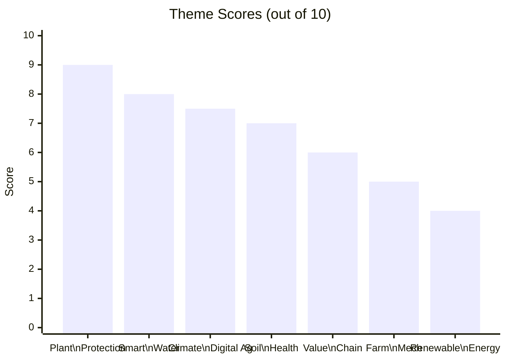
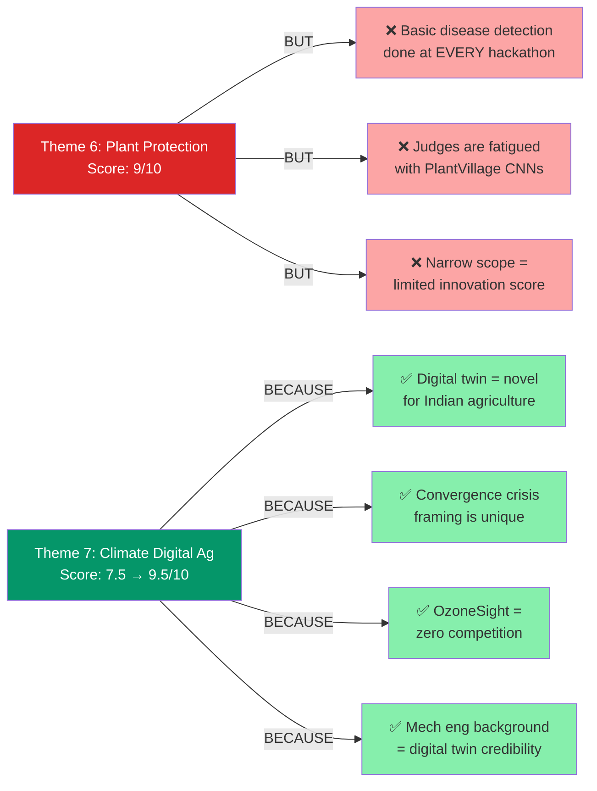
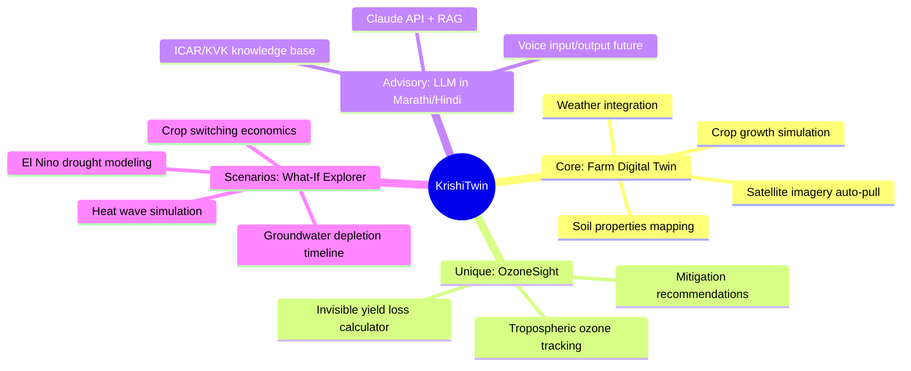
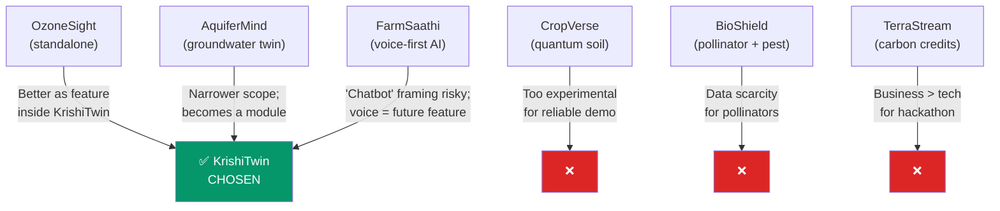

# Decision 001: Theme Selection

**Date:** 2026-03-15 | **Status:** Decided | **Choice:** Theme 7 — Climate Resilient Digital Agriculture

## Evaluation at a Glance

## Why NOT the Top Scorer (Theme 6)?

## Detailed Scoring Matrix

| Theme | SW MVP? | Demo Impact | Differentiation | Data Available | Our Edge | **Score** |
|:------|:-------:|:-----------:|:---------------:|:--------------:|:--------:|:---------:|
| 6. Plant Protection | Yes | Very High | ~~High~~ Overdone | PlantVillage 50K | CS teammate | ~~9~~ **6** |
| **7. Climate Digital Ag** | **Yes** | **High** | **Very High** | **Open sat/weather** | **Mech + twin** | **9.5** |
| 2. Smart Water | Yes | High | Medium | Public APIs | Mech background | **8** |
| 1. Soil Health | Partial | Med-High | Medium | Satellite | Decent | **7** |
| 4. Value Chain | Yes | Medium | Low (crowded) | Govt mandi APIs | Low | **6** |
| 3. Farm Mech | No HW | High if built | High | N/A | Can't build | **5** |
| 5. Renewable Energy | No HW | Low w/o HW | Medium | N/A | Low | **4** |

## Project Chosen: KrishiTwin

## Alternatives Considered

