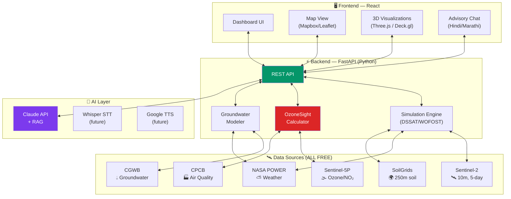
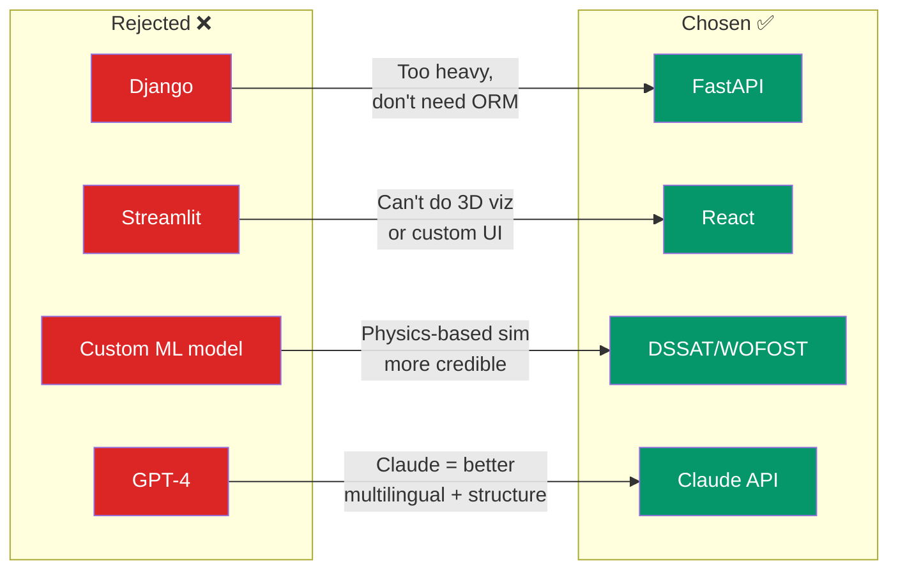

# Decision 002: Technology Stack

**Date:** 2026-03-15 | **Status:** Proposed

## Architecture Overview

## Data Sources

| Data | Source | Resolution | Cost | Access |
|:-----|:-------|:----------:|:----:|:------:|
| 🛰️ Multispectral | Sentinel-2 (ESA) | 10m / 5-day | Free | Google Earth Engine |
| 🌫️ Ozone / NO₂ | Sentinel-5P TROPOMI | 7km | Free | Google Earth Engine |
| ⛅ Weather | NASA POWER | Point / daily | Free | REST API |
| 🌍 Soil properties | SoilGrids (ISRIC) | 250m | Free | REST API |
| 💧 Groundwater | CGWB | District | Free | Scraped |
| 🏭 Air quality | CPCB | Station | Free | API |
| 🌏 Water mass | NASA GRACE-FO | ~300km | Free | Open data |

## Stack Decisions

