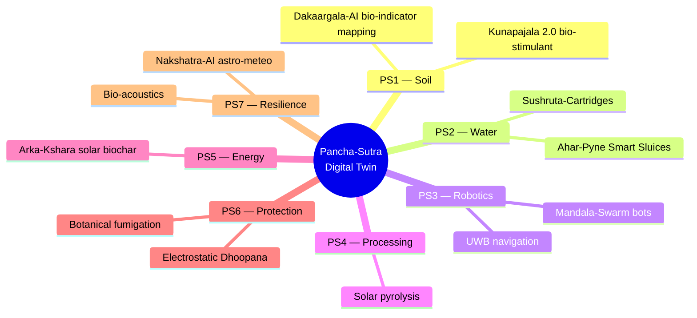
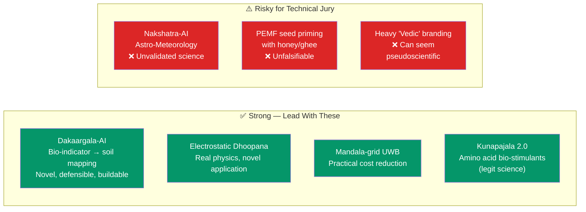
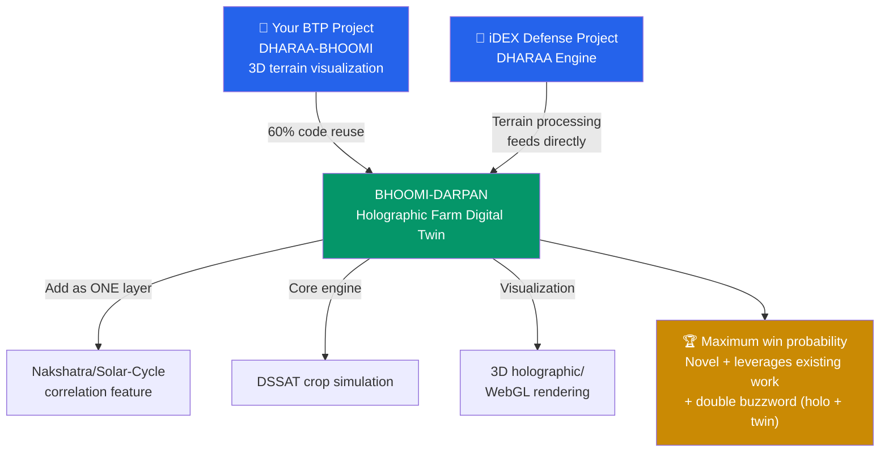

# Hackathon Strategic Plan

**Competition:** Innovations in Climate Resilient, Digital and Sustainable Agriculture
**Problem Statement:** #7 — Climate Resilience & Digital Agriculture

## Current Approach



## Innovation Assessment



## Presentation Strategy

```
┌─────────────────────────────────────────────────────────────┐
│                    HOW TO FRAME IT                           │
│                                                             │
│   LEAD WITH:  Engineering innovations + published science   │
│   USE AS:     Vedic angle = story/differentiator            │
│   NEVER AS:   Vedic angle = the technical foundation        │
│                                                             │
│   ✅ "Statistically significant correlation between solar   │
│      cycle phase and bollworm outbreaks (p < 0.05)"         │
│   ❌ "Ancient Nakshatra wisdom predicts pest outbreaks"     │
└─────────────────────────────────────────────────────────────┘
```

## Strategic Recommendation



## PENDING

Updated project selection based on latest research synthesis (convergence crisis analysis + hackathon pattern research). See `docs/research/hackathon_project_ideas.md` for full ranked list.
