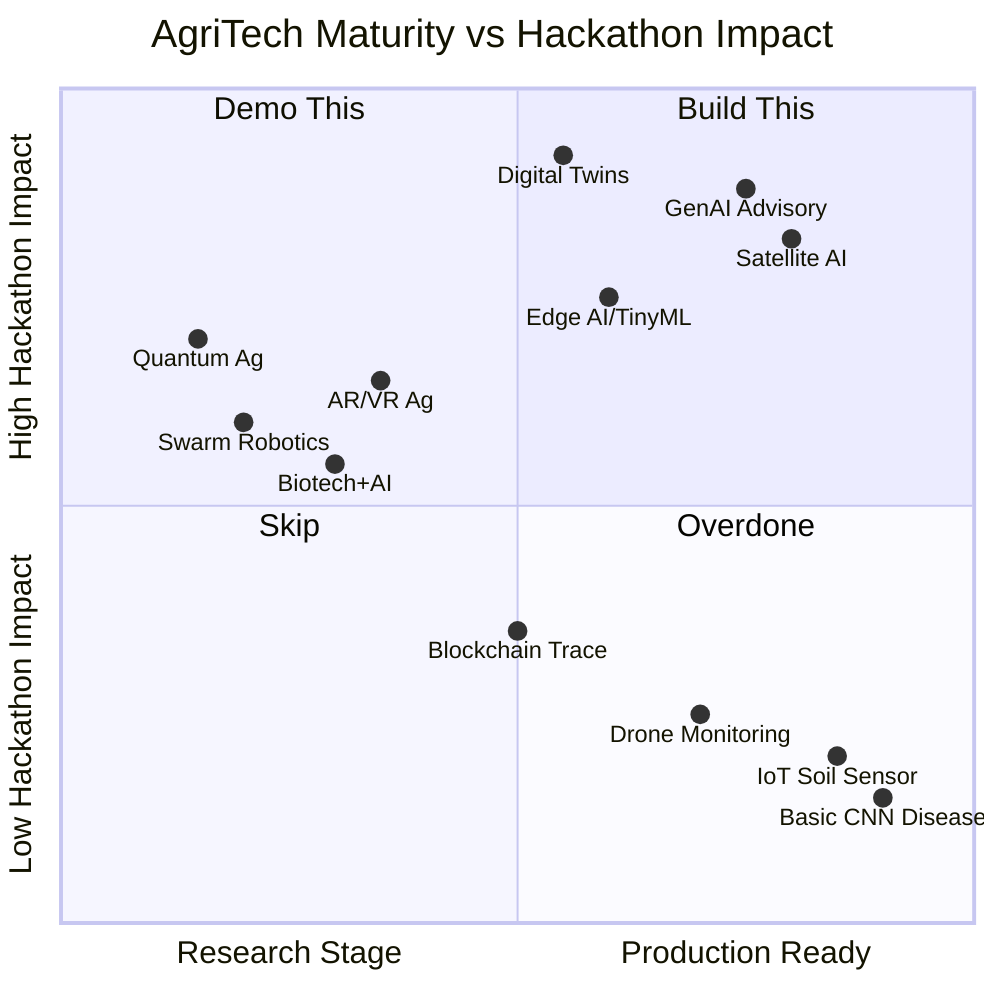
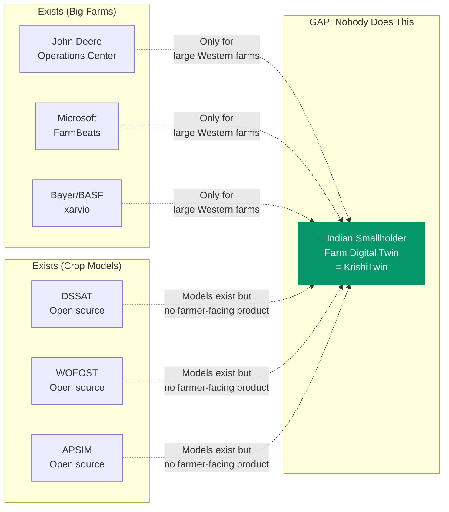
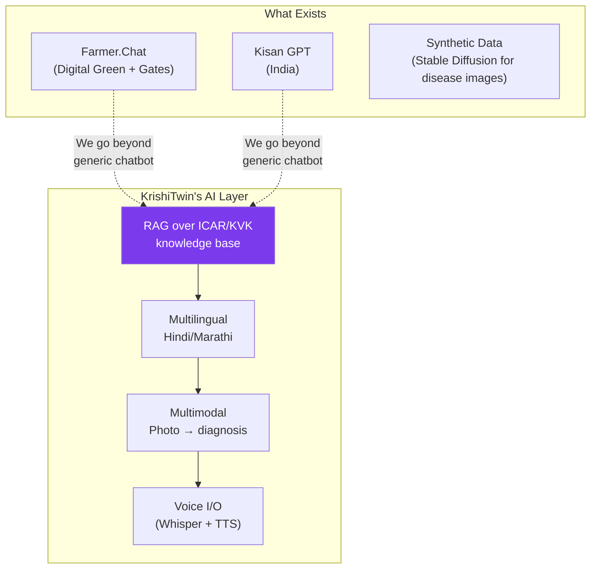
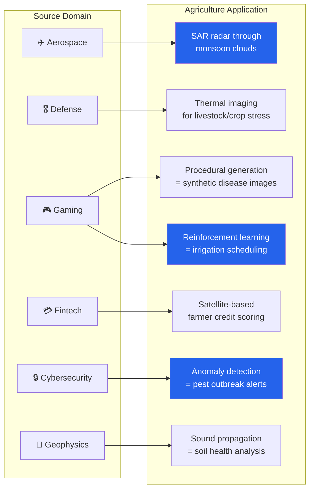

# Cutting-Edge AgriTech: 2026-2029

*Compiled: 2026-03-15*

## Technology Maturity Landscape



---

## 1. Quantum Computing

```
Maturity: ██░░░░░░░░ Very Early / Research

Best ag use case:  Quantum chemistry for fertilizer/pesticide molecular simulation
Hackathon angle:   Hybrid quantum-classical ML on satellite spectral data
                   (PennyLane/Qiskit → variational circuits for feature extraction)
Available now:     IBM Quantum cloud, Amazon Braket (free tier)
By 2029:           Quantum advantage for molecular sims; field sensors prototype
```

| Application | Feasibility for MVP | Wow Factor |
|:------------|:-------------------:|:----------:|
| Quantum ML on spectral data | Medium (cloud simulators) | Very High |
| Quantum chemistry for fertilizer | Low (needs domain expertise) | Very High |
| Quantum sensing for soil | No (hardware needed) | Extreme |

## 2. Digital Twins

```
Maturity: █████░░░░░ Early Commercial / Pilots       ← SWEET SPOT FOR HACKATHON
```



## 3. AR / VR / Spatial Computing

```
Maturity: ███░░░░░░░ Early Exploration

Best ag use case:  AR crop disease overlay on phone camera
                   VR farmer training (ICAR has piloted)
Apple Vision Pro:  No ag apps yet
By 2029:           AR glasses for field advisory overlays
```

## 4. Robotics

```
Maturity: ████░░░░░░ Early Commercial
```

| Category | Leaders | Status | SW-only MVP? |
|:---------|:--------|:------:|:------------:|
| Autonomous tractors | John Deere, Monarch | Commercial | Path-planning sim |
| Laser weeding | Carbon Robotics | Commercial | CV weed classifier |
| Harvesting | Tevel (flying picker) | Pilots | Grasp planning sim |
| Swarm robots | Small Robot Co (UK) | Research | Swarm coordination |
| Micro-pollination | Harvard RoboBees | Research | No |

## 5. Satellite & Hyperspectral

```
Maturity: ████████░░ Commercial & Advancing       ← MOST ACCESSIBLE
```

| Satellite | Resolution | Revisit | Cost | Best For |
|:----------|:----------:|:-------:|:----:|:---------|
| **Sentinel-2** | 10m | 5 days | **FREE** | Crop health, NDVI |
| **Sentinel-5P** | 7km | Daily | **FREE** | Ozone, NO₂, air quality |
| Planet | 3m | Daily | Paid | High-res monitoring |
| **Pixxel** (India) | 5m hyper | - | Paid | Detailed spectral |
| **NASA EMIT** | - | - | **FREE** | Mineral/vegetation |

## 6. Edge AI / TinyML

```
Maturity: ████░░░░░░ Early Commercial

Key breakthrough:  MIT MCUNet — ImageNet models on 256KB SRAM, sub-milliwatt
Ag use cases:      On-device pest ID, soil moisture prediction, grain sorting
By 2029:           Standard in farm sensors, <$10/node, solar-powered
MVP angle:         Train with Edge Impulse → show offline-capable pipeline
```

## 7. Generative AI

```
Maturity: ██████░░░░ Rapidly Emerging              ← HIGHEST DEMO IMPACT
```



## 8-10. Other Technologies

| Tech | Maturity | Best Hackathon Angle | Worth It? |
|:-----|:--------:|:--------------------|:---------:|
| Blockchain | Pilots | Carbon credit tokenization for soil improvement | Maybe Phase 2 |
| Biotech+AI | Advancing | AlphaFold for crop disease resistance proteins | Too specialized |
| 6G | Research | N/A | No |
| Satellite Internet | Early | Connectivity-agnostic architecture | Design principle |
| LoRaWAN/NB-IoT | Mature | Farm IoT data platform | Phase 2 |

---

## Cross-Domain Transfers (Surprise the Judges)


