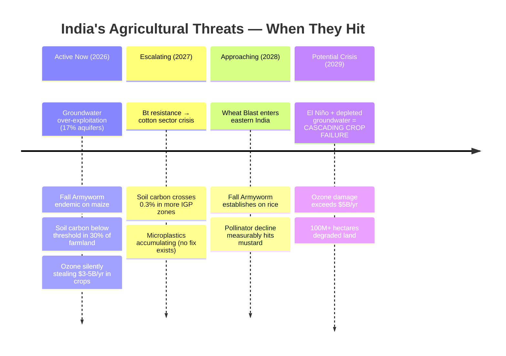
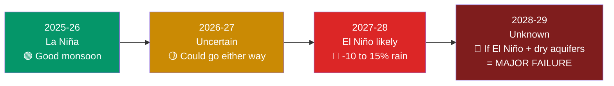
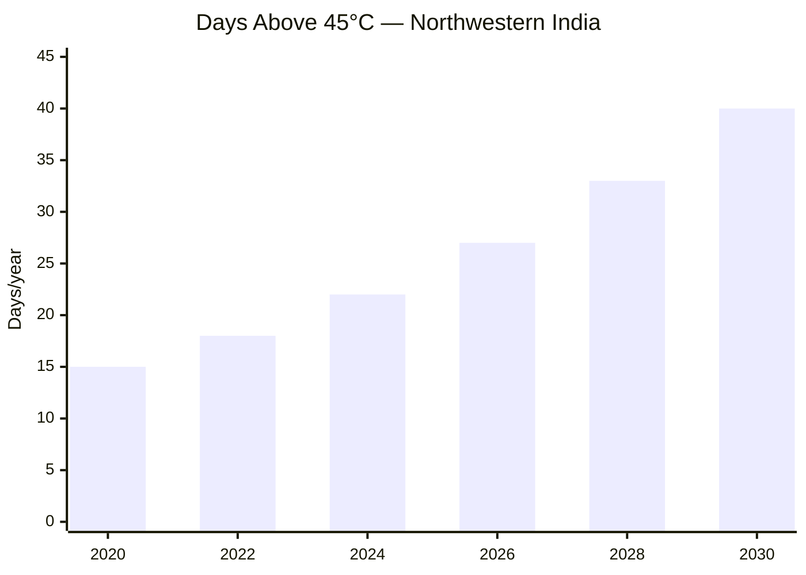
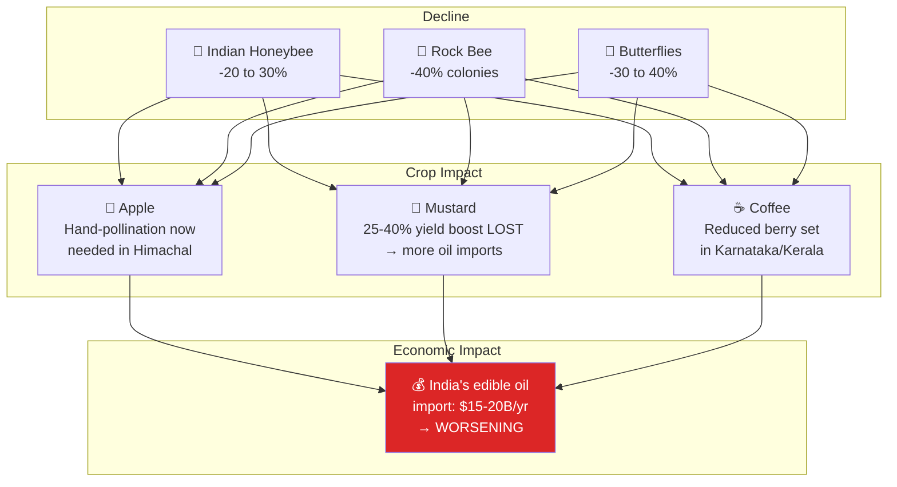
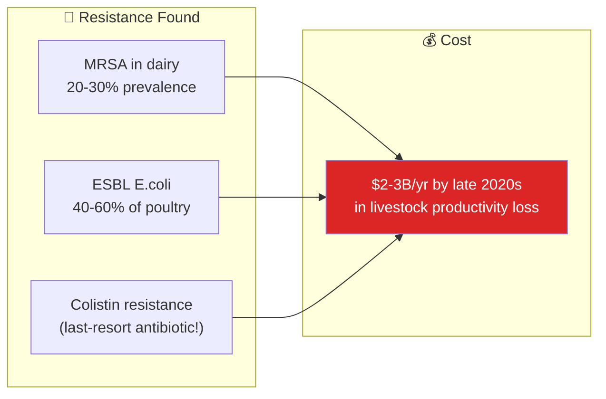
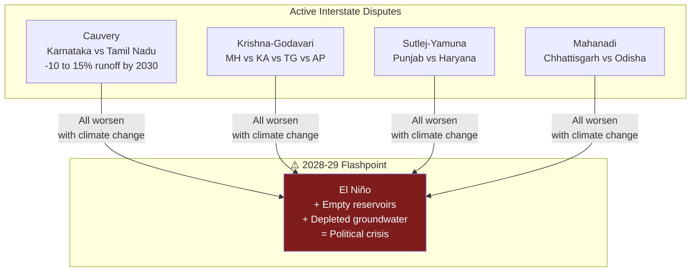
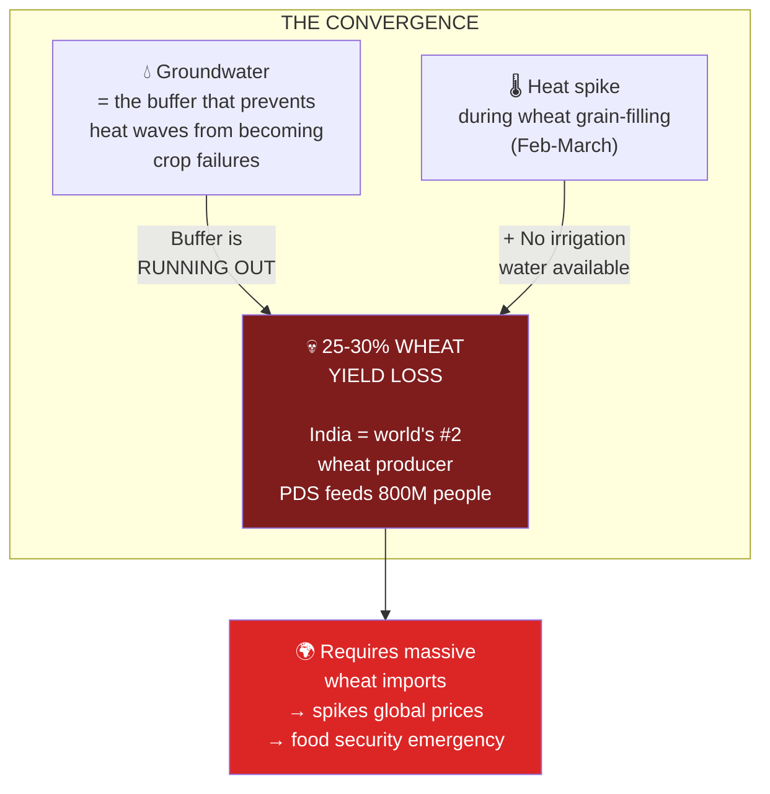

# Environmental Projections: India 2026-2029

*Compiled: 2026-03-15 | Sources: IPCC AR6, IMD, ISRO, CGWB, CPCB, peer-reviewed studies*

## Crisis Timeline



## ENSO (El Niño / La Niña) Outlook



> Even in "good monsoon" years: **dry days within monsoon increased 15% since 1950.** Total rainfall is misleading — distribution is the killer.

## Desertification

```
India's degraded land:

2013:   ████████████████████████████░░░░░░░░░░░░░░  94.5M hectares
2019:   █████████████████████████████░░░░░░░░░░░░░  96.4M hectares (29.3%)
2028:   ██████████████████████████████░░░░░░░░░░░░  ~100M hectares (projected)
        ↑ Adding 500,000 hectares/year

Thar Desert expanding eastward: ~0.5 km/year
Topsoil loss in Bundelkhand: 16-18 tonnes/ha/yr (formation: ~1 tonne/ha/yr)
```

| State | % Degraded |
|:------|:----------:|
| Rajasthan | 62% |
| Gujarat | 52% |
| Jharkhand | 48% |
| **Maharashtra** | **42%** |

## Heat Projections



```
Wet-bulb temperature threat:
IGP cities approaching 35°C wet-bulb (human survivability limit)
Lucknow, Patna, Varanasi → 32°C+ wet-bulb for 30+ days/yr by late 2020s
```

## Pollinator Decline



## Microplastics in Soil — Silent Accumulation

```
                    No remediation technology exists at scale
                                    ↓
Particles/kg:   █░░░░░░░░░ 100         Rural farmland
                ██████░░░░ 3,000       Peri-urban farms (40% of urban veg supply!)
                ██████████ 5,000       Gangetic floodplain (Kanpur/Varanasi)

Sources:  Plastic mulch → Wastewater irrigation → Contaminated compost → Flood debris
Trend:    India generates 3.5M+ tonnes plastic waste/yr, growing 9-10%, recycling 30%
Effect:   Alters soil structure, reduces water retention, harms earthworms/microbiome
```

## Antibiotic Resistance in Livestock



## Biodiversity Collapse in Farm Ecosystems

| Indicator | Decline | Consequence |
|:----------|:-------:|:------------|
| Earthworms (IGP) | -40 to 60% | Soil structure breakdown |
| Mycorrhizal fungi | Significant | Nutrient uptake impaired |
| Beneficial insects | Declining | Need 2-3x more pesticide |
| Farmland birds | -30 to 50% | Natural pest control lost |
| Vultures | -99% | Carcass disposal crisis |

## Urban Encroachment

```
Farmland lost: ~150,000-200,000 hectares/year to urbanization

Net sown area: 141M ha (2005) → 139M ha (2020)

⚠️ The land being lost is THE BEST land — flat, irrigated, near roads
   Replaced by marginal land from forest clearing (ecologically destructive)

Hotspots: NCR, Bangalore-Mysore, Pune-Mumbai corridor, Hyderabad periphery
```

## Water Conflicts



## The #1 Biggest Crisis by 2028-2029



> **This is not hypothetical.** It's a statistical near-certainty within the decade.
> KrishiTwin is designed to model exactly this convergence.
