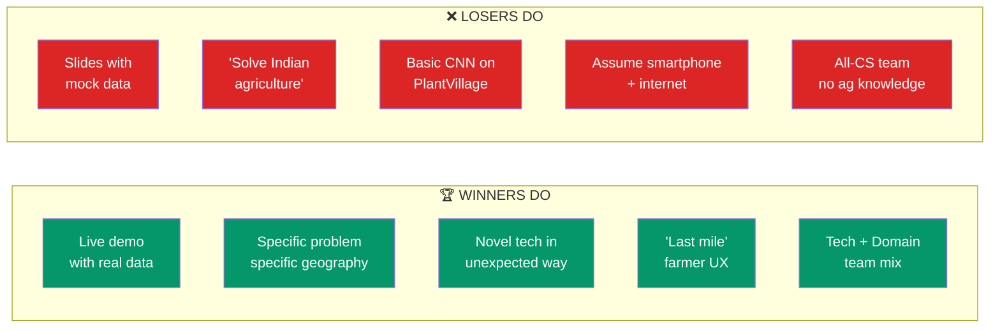
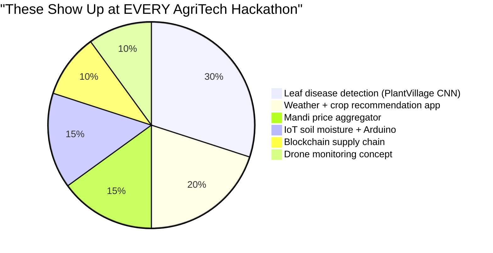
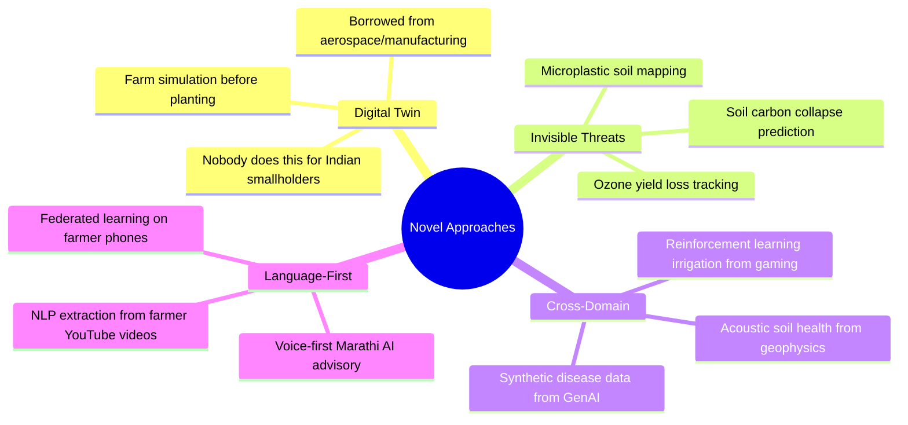
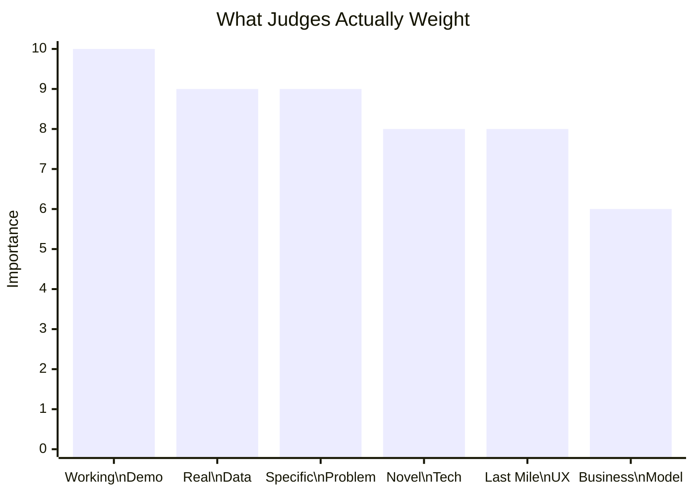
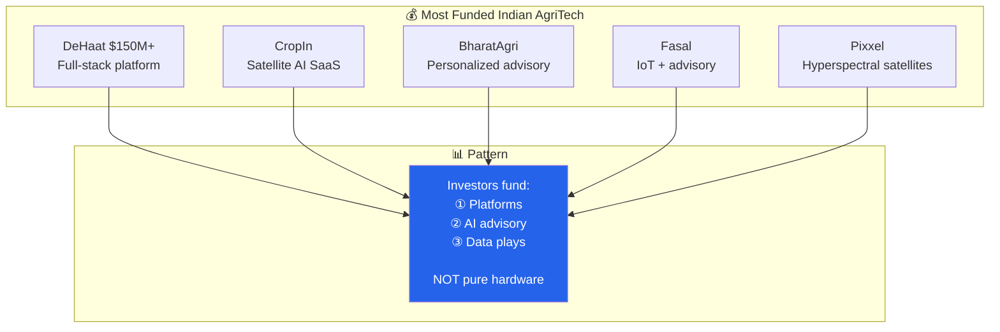

# Hackathon Winning Patterns

*Compiled: 2026-03-15 | Sources: SIH, NABARD, ICAR, MIT Solve, Google Solution Challenge, NASA Space Apps*

## Winners vs Losers — At a Glance



## Overdone Ideas (AVOID)



> Unless your execution is **extraordinary**, judges will mentally check out when they see these.

## What Would Surprise Judges



## Notable Winners We Studied

| Competition | Winner | What Made It Win |
|:------------|:-------|:-----------------|
| MIT Solve | Ignitia | Hyperlocal tropical weather ML |
| MIT Solve | Kheyti (India) | Greenhouse-in-a-Box, 90% water reduction |
| Google Solution | FarmSense | Acoustic insect monitoring via phone mic |
| NASA Space Apps | Various | Sentinel/Landsat + ML for drought prediction |
| SIH India | Various | AI disease detection **with real farmer pilot data** |

## Judging Criteria — How to Score High



## Pune-Specific Judge Intel

```
🎯 Located at Agricultural College, Pune (one of Asia's oldest)
🎯 Judges care about: sugarcane, cotton, soybean, onion, pomegranate
🎯 Marathi language support = instant rapport
🎯 Sugarcane-water paradox is politically charged → handle with DATA not opinion
🎯 e-Peek Pahani (digital crop survey) → complement govt digitization
```

## Funded AgriTech = Signal for What's Valued



## How KrishiTwin Hits Every Winning Pattern

| Pattern | KrishiTwin | Score |
|:--------|:-----------|:-----:|
| Live demo with real data | Input any GPS → instant analysis | ✅ |
| Specific geography | Maharashtra crops, Pune groundwater | ✅ |
| Novel tech application | Digital twin from aerospace → agriculture | ✅ |
| Technical depth | Satellite + simulation + LLM + ozone | ✅ |
| Last mile UX | Hindi/Marathi advisory, simple GPS input | ✅ |
| Team credibility | Mech eng → digital twin is native domain | ✅ |
| Not overdone | Zero other teams doing farm digital twins | ✅ |
