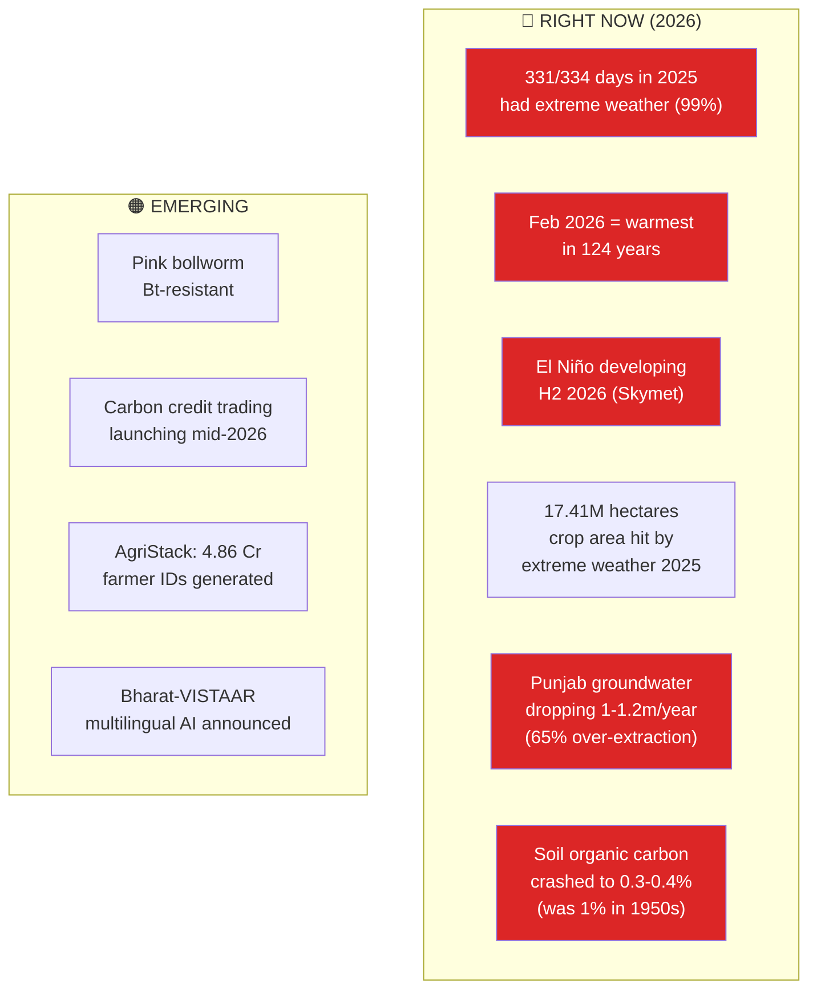
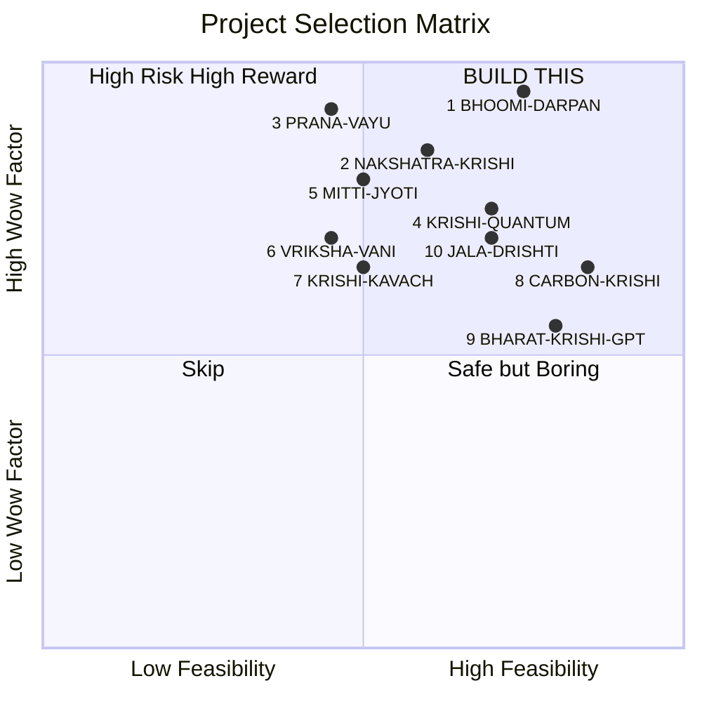
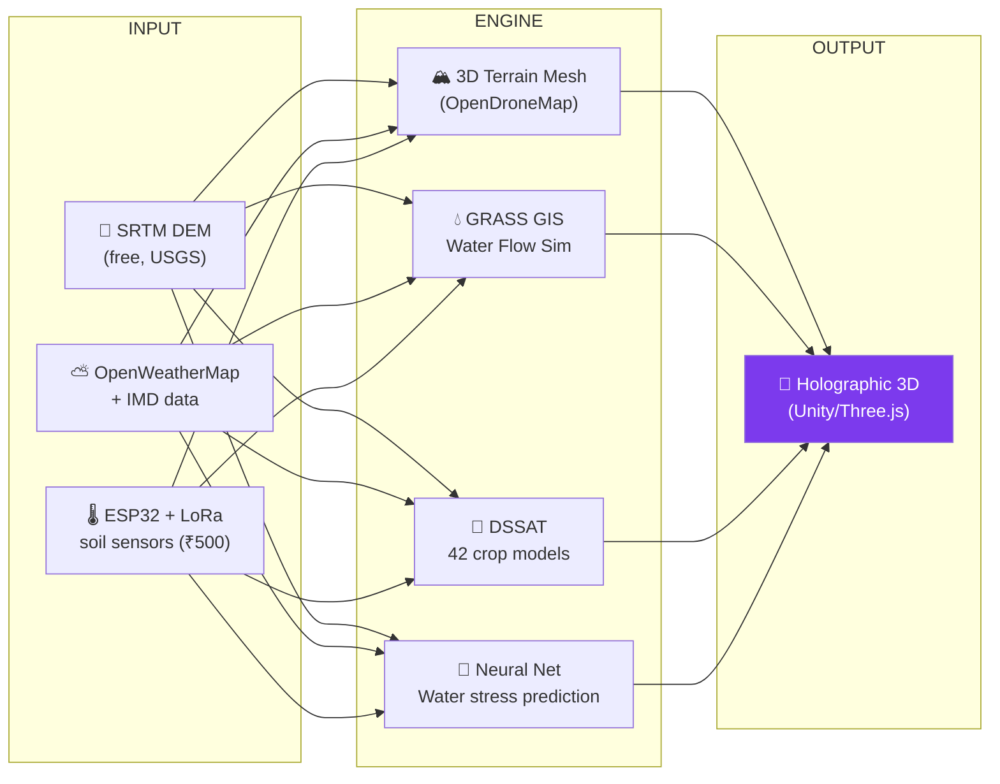
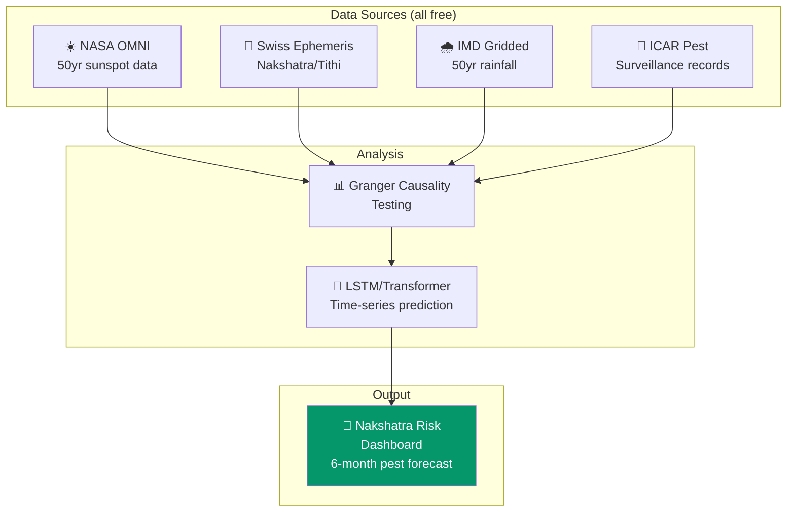
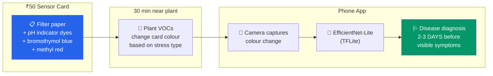
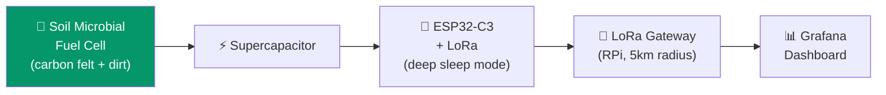
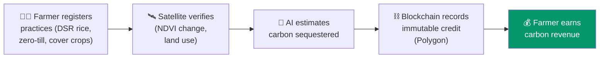
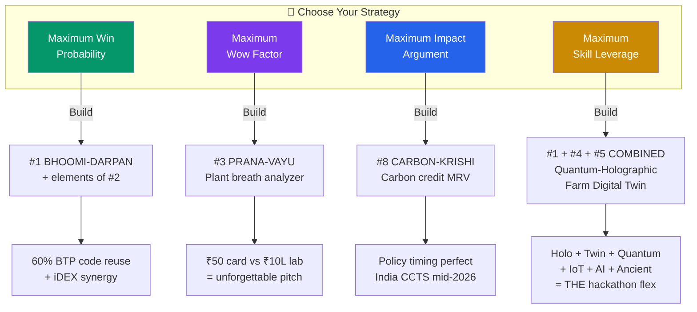

# Hackathon Project Ideas — Climate Resilient Digital Agriculture

**Problem Statement 7:** Innovations in Climate Resilient, Digital and Sustainable Agriculture

---

## India 2026-2029: The Crisis Dashboard



### Projected 2027-2029

```
Monsoon:        More intense BUT more concentrated → longer dry spells
Glaciers:       Peak meltwater NOW → then decline (ticking time bomb)
Flood peaks:    Indus +51% | Brahmaputra +80% | Ganga +108%
Wheat yields:   -10 to 20% from heat stress alone (without adaptation)
Fall Armyworm:  Endemic across ALL maize regions (15-73% yield loss)
FPOs:           10,000 exist, operating on 3-6% margins
Labour:         Rural-to-urban migration accelerating
Carbon credits: Compliance market operationalizing → real farmer revenue
```

---

## Project Rankings



---

## TIER S: "I've Never Seen Anything Like This"

---

### 1. BHOOMI-DARPAN — Holographic Digital Twin of a Farm Watershed



```
WHY IT WINS:
├── 60% code reuse from your BTP (DHARAA-BHOOMI)
├── "Digital twin" + "holographic" = double buzzword WITH substance
├── Solves #1 problem: water (India lost 450 km³ groundwater in 20 yrs)
├── Nobody has built a holographic farm digital twin
└── Terrain hydrology feeds your iDEX DHARAA project

COST:  ₹3,000-5,000 (sensors + LoRa)
BUILD: 5 weeks
```

| Week | Deliverable |
|:----:|:------------|
| 1 | DEM → 3D terrain mesh + water flow simulation |
| 2 | DSSAT integration + weather API + soil sensors |
| 3 | 3D visualization (Unity/Three.js) with layers |
| 4 | AI water stress prediction model |
| 5 | Integration, demo polish, presentation |

---

### 2. NAKSHATRA-KRISHI — Solar-Lunar Cycle AI for Pest & Weather Prediction



```
PUBLISHED SCIENCE BACKING:
├── Sunspot ↔ locust outbreaks (Agronomy journal)
├── Cotton bollworm ↔ solar cycles (PMC 2025)
├── Panchang rainfall "on par with" IMD predictions
└── 2025 Springer: "Ancient Wisdom & Modern Science... Solar Cycles & Remote Sensing"

⚠️ PRESENTATION RULE:
   Lead with: "Statistically significant correlations (p < 0.05, Granger test, 30yr dataset)"
   NOT with: "Vedic astrology predicts pest outbreaks"

COST: ₹0 | BUILD: 5 weeks
```

---

### 3. PRANA-VAYU — Plant Breath Analyzer (VOC Sensing + Phone Camera)



```
WHY IT WINS:
├── Based on Cell paper (Khait et al., 2023) — plants emit VOCs under stress
├── ₹50 sensor card vs ₹10,00,000 lab equipment = 20,000x cost reduction
├── "Reading a plant's breath" = unforgettable pitch
├── Detects disease BEFORE visible symptoms
└── Physical prototype judges can hold and smell

⚠️ RISK: Needs chemistry lab access at IIT for reagent prep + controlled plant experiments

COST: ₹2,000-3,000 | BUILD: 5 weeks
```

---

## TIER A: Technically Impressive + Highly Feasible

---

### 4. KRISHI-QUANTUM — Quantum-Enhanced Crop Yield Optimization

```
QAOA (quantum algorithm) on IBM Qiskit → optimize crop-water allocation
Reward function = DSSAT crop yield simulation
Dashboard: quantum vs classical solution comparison

Published: EPJ 2025 — QYieldOpt framework, 89% water utilization efficiency
Novelty: "Quantum computing for agriculture" = ZERO Indian hackathon precedent

COST: ₹0 | Pure software
```

### 5. MITTI-JYOTI — Soil-Powered IoT Sensor Network



```
"Zero-battery, zero-solar, forever-running sensor" — from DIRT
├── Northwestern University published 2024, peer-reviewed
├── Bactery (startup) commercializing NOW
├── Demo: LED lights up from DIRT in front of judges
├── ₹500/node vs ₹5,000+ for solar IoT
└── COST: ₹3,000-5,000 for 3-4 nodes + gateway
```

### 6. VRIKSHA-VANI — Acoustic Tree Health Scanner

```
Sound waves through tree trunk → 2D cross-section of internal decay
Like a CT scan for trees. Targets ₹50,000+ Cr plantation economy.

USDA Forest Service version: ₹5-10 lakh
Your DIY version: ₹3,000-5,000

Tech: 4-8 piezo sensors + Arduino + time-of-flight tomography algorithm
```

### 7. KRISHI-KAVACH — Electrostatic Pest Shield + IoT

```
Solar-powered electrostatic mesh → repels/kills insects, no chemicals
IoT counter tracks intercept rates → pest pressure dashboard
Published: MDPI Agronomy 2025 — 10x better coverage than spraying

COST: ₹3,000-4,000
```

---

## TIER B: Strong Software-Only (₹0 Cost)

---

### 8. CARBON-KRISHI — Carbon Credit MRV Platform for Smallholders



```
TIMING IS PERFECT:
├── India's carbon credit trading scheme launching mid-2026
├── ₹20,000 Cr CCUS support in Budget 2026-27
├── Varaha (Indian startup) raised millions proving the model
└── NO farmer-facing MRV tool exists yet — you'd be FIRST
```

### 9. BHARAT-KRISHI-GPT — Offline Multilingual Farm AI

```
Airplane mode ON → photograph crop → instant diagnosis in Hindi
├── EfficientNet-Lite (PlantVillage) → TFLite
├── Vosk offline speech recognition (Hindi)
├── Phi-3-mini quantized 4-bit via llama.cpp
├── Fine-tuned on ICAR advisory + Kisan Call Center transcripts
└── 70% of India's farmers have limited internet
```

### 10. JALA-DRISHTI — Groundwater Digital Twin

```
3D aquifer visualization + 6-month water table prediction
├── GRACE-FO satellite (free, NASA) → gravitational anomaly → groundwater mass
├── CGWB well monitoring data
├── LSTM/Transformer time-series prediction
├── Three.js 3D aquifer rendering
└── Optional: NV-center ODMR bench demo (₹15,000) for quantum sensing concept
```

---

## Strategic Decision Matrix



### The Ultimate Combo (Maximum Skill Leverage)

```
QUANTUM-HOLOGRAPHIC FARM DIGITAL TWIN
│
├── 🏔️ 3D holographic terrain (BTP + DHARAA code)
├── 🌾 DSSAT crop simulation engine
├── ⚛️ Quantum optimization (QAOA, IBM Qiskit) for water allocation
├── 🔋 Soil-powered IoT sensors feeding live data
└── 🌙 Nakshatra-AI layer for long-range pest/weather risk

Hits: holography + digital twin + quantum + IoT + AI + ancient knowledge + climate resilience
Audacious, but buildable in 5 weeks with scoped MVPs per component.
```
