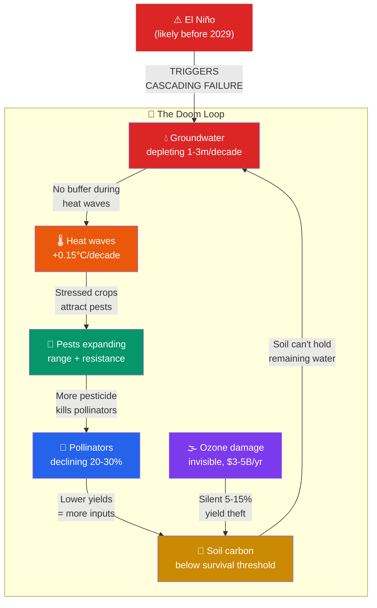
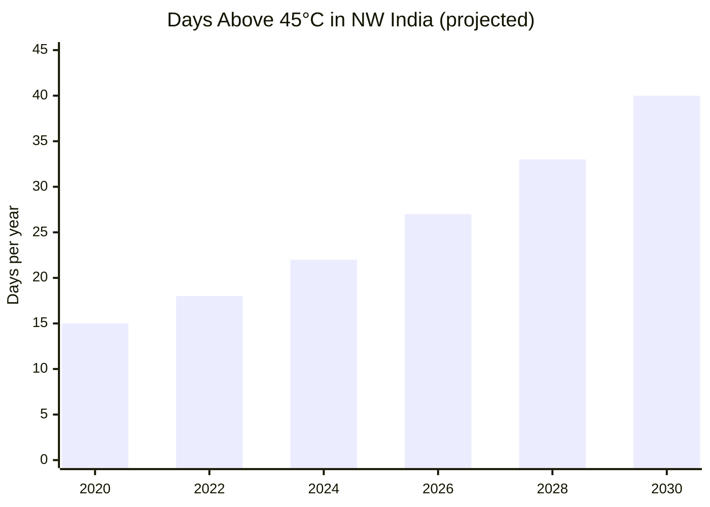
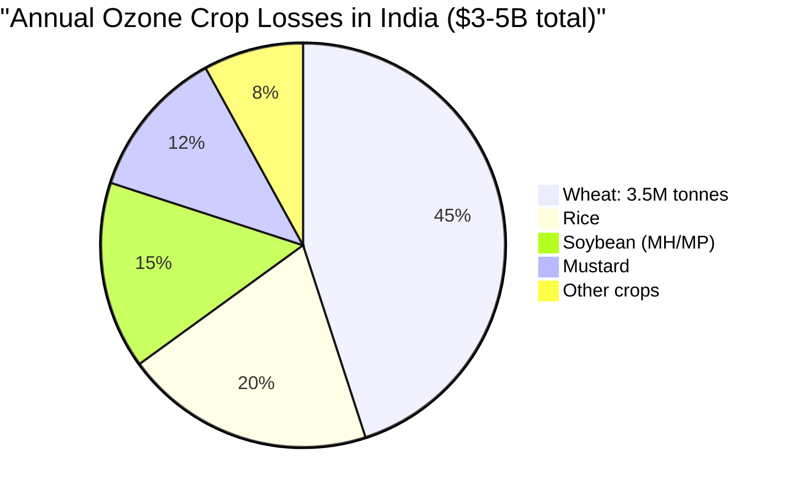
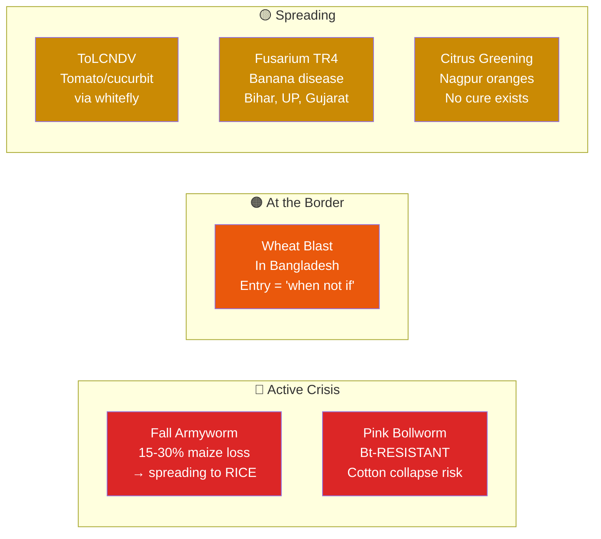
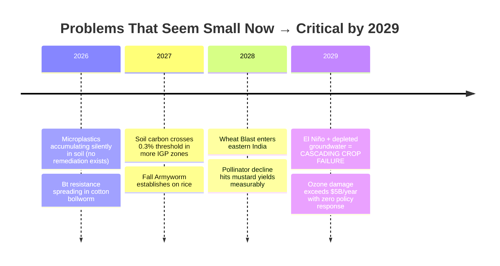
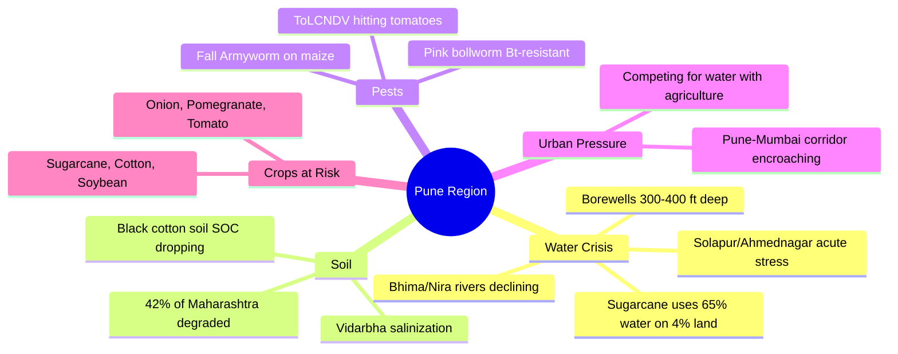

# India Agriculture Crisis: 2026-2029

*Compiled: 2026-03-15 | Sources: IPCC AR6, CGWB, IMD, ISRO, ICAR, World Bank, FAO*

## The Convergence Crisis



---

## Crisis-by-Crisis Snapshot

### 1. Groundwater

```
India = World's #1 groundwater extractor (250 billion m³/year > US + China combined)

Status:     ████████████████████░░░░░ 17% aquifers OVER-EXPLOITED
By 2032:    ████████████████████████████████████████████████████████████░ 60% CRITICAL

Maharashtra Sugarcane Paradox:
  Cropped area:     ████ 4%
  Irrigation used:  ████████████████████████████████████████████████████████████████████ 65%
```

| Region | Status | Trend |
|:-------|:------:|:-----:|
| Punjab, Haryana | Over-exploited | Dropping 0.5-1.0 m/year |
| Marathwada, Vidarbha | Severe | Drought near-annual |
| Solapur, Ahmednagar | Acute stress | Borewells at 300-400 ft |
| Pune district | Moderate | Urbanization competing |

### 2. Heat Stress



| Crop | Impact per +1°C | Current Loss |
|:-----|:---------------:|:------------:|
| Wheat (grain-filling) | -5 to -7% yield | 10-15% in IGP |
| Rice (night temp >26°C) | -10% yield | Increasing |
| Dairy (milk production) | -10 to -25% | $10-25B sector at risk |

### 3. Soil Organic Carbon — The Collapse Threshold

```
Desirable SOC:  ████████████████████ 1.5-2.0%
IGP 40 yrs ago: ██████████████ 0.5-0.7%
IGP today:      ████████ 0.3-0.4%          ← APPROACHING NON-LINEAR COLLAPSE
Threshold:      ██████ 0.3%                ← Below this, soil stops functioning

Land degraded:  96.4 million hectares (29.3% of India)
                Adding ~500,000 hectares/year
```

### 4. Tropospheric Ozone — The Invisible Yield Thief



> **IGP ozone: 60-100 ppb** during rabi season. Crop damage threshold: 40 ppb.
> Farmers cannot see, smell, or diagnose this. It shows up as "unexplained low yield."

### 5. Monsoon Disruption

```
Total rainfall:          Stable (misleading!)
Rainy days:              ↓ 15% fewer since 1950
Extreme rainfall events: ↑ 3x since 1950 in central India
Pattern:                 Long dry spell ──── DELUGE ──── Long dry spell
```

### 6. Pest & Disease Threats



### 7. Pollinator Decline

| Pollinator | Decline | Crop Impact |
|:-----------|:-------:|:------------|
| Indian honeybee | -20 to 30% | Mustard yield boost lost (25-40%) |
| Rock bee | -40% colonies | Wild pollination of fruit |
| Butterflies | -30 to 40% | Indicator species |
| **Result** | → Apple hand-pollination now required in Himachal | → $15-20B/yr edible oil import bill worsens |

### 8. Hidden & Emerging Threats



---

## Food Security Outlook

```
Population:     1.44B (2025) → 1.50B (2030)     +4% people
Food demand:    ↑ 15-20% by 2030                  +20% food needed
Climate loss:   -5 to 15% yields without adaptation   -10% supply

EDIBLE OIL:     ████████████████████████████████████████████████████████████ 60% IMPORTED ($15-20B/yr)
PULSES:         ████████████████████████ $2-3B imported annually
WHEAT AT RISK:  World's 2nd largest producer, concentrated in the exact
                region facing groundwater + heat convergence
```

---

## Maharashtra / Pune Region Specifically


